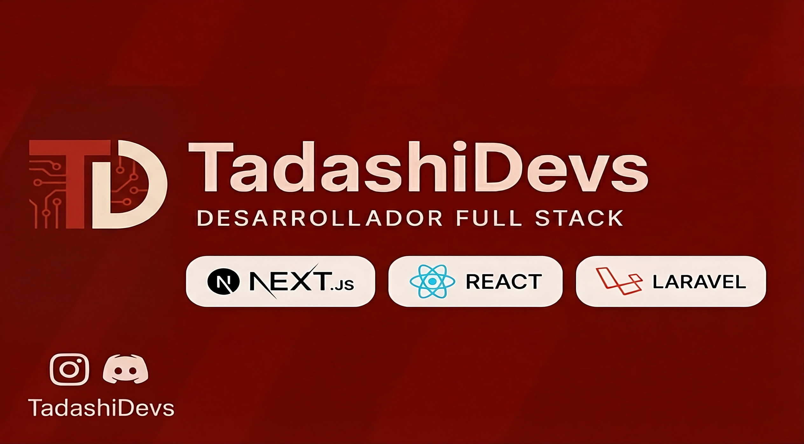
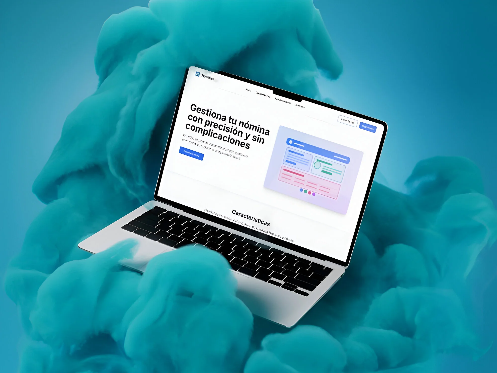

  

  
  
  
  
  

---

## 👨‍💻 Sobre Mí

Soy **Ingeniero de Sistemas** con pasión por desarrollar soluciones tecnológicas que transformen ideas en productos digitales funcionales y escalables. Cuento con experiencia profesional en el desarrollo **Full Stack**, trabajando tanto en el frontend como en el backend, además de tener conocimientos avanzados en gestión de bases de datos.

Desarrollo aplicaciones y sistemas que combinan **solidez técnica** con una **experiencia de usuario excepcional**. Integro principios de diseño centrado en el usuario con el desarrollo técnico, garantizando que cada interfaz sea intuitiva, atractiva y funcional.

Trabajo con **metodologías ágiles** y herramientas modernas para desarrollar productos de alta calidad. Me enfoco en escribir código limpio, mantenible y bien documentado, aplicando buenas prácticas y optimizando el rendimiento para generar valor real al usuario final.

Disfruto enfrentar nuevos desafíos técnicos y colaborar con equipos multidisciplinarios para lograr objetivos comunes. Mi objetivo es desarrollar soluciones digitales que combinen **funcionalidad, diseño y rendimiento**. Busco crear productos que resuelvan problemas reales mientras ofrezco una experiencia de usuario fluida y profesional.

---

## 💎 Skills

### Front-End Development

  
  
  
  
  

### Back-End Development

  
  
  
  
  

### Databases

  
  

### Tools & DevOps

  
  
  
  
  

---

## 🚀 Proyectos Destacados

<table>
<tr>
<td width="50%" align="center">

### NomiSys

Sistema web para gestionar nóminas y planillas. Incluye cálculo de sueldos, deducciones, contratos laborales y generación de boletas PDF.

  
  
  
  

</td>

<td width="50%" align="center">

</td>
</tr>
</table>

---

## 📊 GitHub Stats

  <table align="center">
    <tr border="none">
      <td width="50%" align="center">
        
          
         
      </td>
      <td width="50%" align="center">
        
      </td>
    </tr>
  </table>

---

  
  ### 💬 ¡Conectemos!
  
  **¿Tienes un proyecto en mente? ¡Hablemos!**
  
  
  
  
  
  
  

